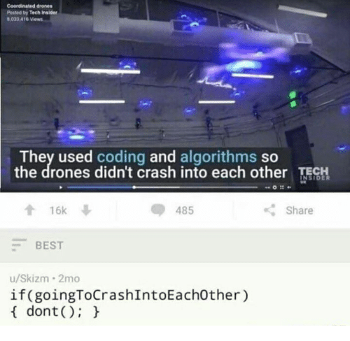

# Small task 5 - Calculator

This week's assignment will test your understanding of Rust's multi-threading capabilities.

Your goal is to implement a calculator server that can be used by multiple clients at the same time.
The server should support the following operations:
- Addition
- Multiplication
- Division
- Getting the result
- Getting the history of all arithmetic operations of all clients
- Getting the history of all arithmetic operations of the current client
- Stopping the server

The server communicates with clients via TCP sockets using JSON.
Objects should be encoded using default `serde_json` serialization.

You can take a look at the [last chapter of the Book](https://doc.rust-lang.org/stable/book/ch20-00-final-project-a-web-server.html) for inspiration.

This time there are two test files.
If you complete only the easy part, you can get at most 2/3 points.

You must not use any external libraries for this task (other than `serde`).
You must not modify the tests (obviously).
